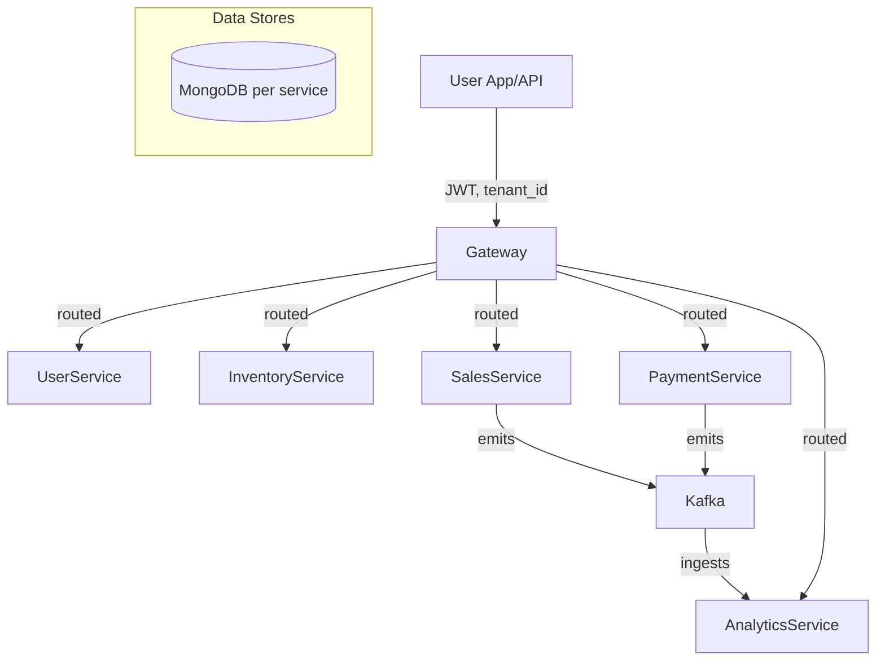

# Retail Management Platform

**Modern Multi-Tenant SaaS for Indian Retail – GST-compliant, Modular, and Analytics-Ready**

## ✨ Features

- **B2B Multi-Tenancy:** Complete data isolation for each tenant (business); all records are tenant-scoped.
- **Mobile-First, India-Ready Flows:** Daily sales, credit/udhaar, UPI payments, GST, WhatsApp-based sharing.
- **Automated GST Invoice PDFs:** PDF generation for every key transaction, shareable via WhatsApp or API.
- **Modular Microservices:** Services for user management, inventory, sales, payments, notifications, analytics – all with their own MongoDB.
- **Role-Based Auth (JWT):** Secure, auditable. Permissions enforced at route, model, and DB level.
- **Event-Driven:** Business events (sale, payment, inventory, etc.) sent via Kafka for analytics and reporting.
- **Developer-Friendly API and Docs:** OpenAPI/Swagger UI always available at `/docs` per service.
- **Production-Ready Docker Orchestration:** Simple Docker Compose for local dev; scalable for staging/prod.


## 📦 Project Structure

```
project-root/
  services/
    user_service/
    tenant_service/
    inventory_service/
    sales_service/
    payment_service/
    notification_service/
    analytics_service/
  shared/            # Optional: cross-service auth/utilities
  docker-compose.yml
  README.md
  .env.example
```


## 🚀 Quickstart

### **Start All Services via Docker Compose**

```sh
docker compose up --build
```

- All backend APIs, MongoDBs, Kafka, and Zookeeper will run.
- Health: `docker compose ps` to see what’s live.


### **Access APIs and Docs**

| Service | Docs URL | Port |
| :-- | :-- | :-- |
| User | http://localhost:8001/docs | 8001 |
| Inventory | http://localhost:8002/docs | 8002 |
| Sales | http://localhost:8003/docs | 8003 |
| Payment | http://localhost:8004/docs | 8004 |
| Analytics | http://localhost:8008/docs | 8008 |

## 🌐 How To Use The Backend Without a Frontend

1. **Register a User**
    - `POST http://localhost:8001/register`
    - Body: tenant_id, username, mobile, password, email, business_name
2. **Get JWT Token**
    - `POST http://localhost:8001/login`
    - Use JWT from response for all further requests:
`Authorization: Bearer <your-jwt>`
3. **Manage Inventory**
    - Add item: `POST http://localhost:8002/items`
    - List items: `GET http://localhost:8002/items`
4. **Create Sales**
    - `POST http://localhost:8003/sales`
    - View/download invoices: `GET /sales/{sale_id}/invoice`
5. **Record Payment**
    - `POST http://localhost:8004/payments`
6. **Check Analytics**
    - `POST http://localhost:8008/reports`

> For each call, use Postman or curl, always passing JWT and tenant_id as needed.

## 🏗️ System Overview




## 📝 Key API Endpoints

### User Service

| Path | Method | Purpose |
| :-- | :-- | :-- |
| `/register` | POST | Register user/tenant |
| `/login` | POST | Authenticate user |
| `/users` | GET | List users (admin only) |
| `/users/{uname}` | GET | User profile |
| `/users/{uname}` | PATCH | Admin user update |
| `/profile` | GET | Self-profile info |
| `/profile` | PATCH | Update own profile |

### Sales Service

| Path | Method | Purpose |
| :-- | :-- | :-- |
| `/sales` | POST | New sale |
| `/sales` | GET | List sales |
| `/sales/{id}` | GET | Get sale details |
| `/sales/{id}` | PATCH | Edit sale (admin/event only) |
| `/sales/{id}/invoice` | GET | GST invoice download |
| `/sales/{id}/share_invoice` | POST | Invoice WhatsApp/email share |
| `/sales/export` | GET | Export sales (CSV, PDF) |

### Inventory Service

| Path | Method | Purpose |
| :-- | :-- | :-- |
| `/items` | POST | Add inventory item |
| `/items` | GET | List inventory items |
| `/items/{item_id}` | GET | Get item details |
| `/items/{item_id}` | PATCH | Update item |
| `/items/{item_id}` | DELETE | Delete item |
| `/alerts` | GET | Low/out of stock alerts |

### Payment Service

| Path | Method | Purpose |
| :-- | :-- | :-- |
| `/payments` | POST | Record payment |
| `/payments` | GET | List all payments |
| `/payments/{id}` | GET | Get payment details |
| `/sales/{sale_id}/payments` | GET | Payments for a sale |
| `/webhook/upi` | POST | UPI webhook callbacks |

### Analytics Service

| Path | Method | Purpose |
| :-- | :-- | :-- |
| `/` | GET | Liveness check |
| `/reports` | POST | Generate/query analytics report |
| `/analytics/{tenant_id}/event_counts` | GET | Per-tenant event counts |
| `/events` | GET | Raw event listing (debug) |

## 🔏 Multi-Tenancy \& Security

- All requests (except `/register`, `/login`, `/health`) require:
    - JWT token in `Authorization` header
    - `tenant_id` parameter in payload/body
- Compound unique DB indexes: (`tenant_id`, `resource_id`) for all data.
- Role-based API/DB enforcement: no user can access other tenants' data.
- Passwords always hashed (bcrypt); no plain-text storage.


## 📄 GST Invoice

- Auto-generated as PDF for every B2B sale (per GST rules).
- View/download: `GET /sales/{sale_id}/invoice`
- Share over WhatsApp: `POST /sales/{sale_id}/share_invoice`


## 🧪 Testing \& Health Checks

- Each service: `/health` endpoint for liveness.
- Swagger UI/API docs at `/docs` on each service port.
- Full test flows (register → login → add item → sale → payment → analytics) can be done via Postman/cURL.
- Typical test case:

1. Register and login; use JWT.
2. Add inventory, create a sale.
3. Download/share invoice.
4. Record payment, check analytics.


## 🛠️ Troubleshooting

- **Service not running?** Use `docker compose ps` and `docker compose logs <service>` to debug.
- **Database errors?** Check MongoDB containers and credentials.
- **Kafka errors?** Ensure Kafka and Zookeeper containers are running and reachable by all APIs.
- **Auth errors?** Ensure you are sending JWT and using correct tenant.


## 🤝 Contribution \& Support

- Fork repo, branch from main, PR to contribute new flows or fixes.
- For issues, check per-service `/docs` and `docker-compose.yml`.
- Escalation: reach out to platform owner or tech lead as listed in `/docs` or company directory.


## 📑 References

- See `/docs` endpoints for schema, payloads, and live test/playground.
- Full handover, architecture, data model, and design docs are in:
    - `Retail Management Platform – Multi-Service Archite.md`
    - `Retail Management Platform – Full Low Level Design.md`
    - `Retail Management Platform – High Level Design (HL.md)`
    - `Retail Management Platform – Data Flow (Mermaid Di.md)`
    - `Retail Management Platform – Complete Data Model.md`
    - `Service Orchestration & Deployment (Docker Compose Cluster).md`
    - `documentation update 20072025.md`

**You’re running a robust, secure retail backend ready for production, testing, and rapid team onboarding. All APIs are self-documenting and cloud-agnostic.**

<div style="text-align: center">⁂</div>

[^1]: README.md

