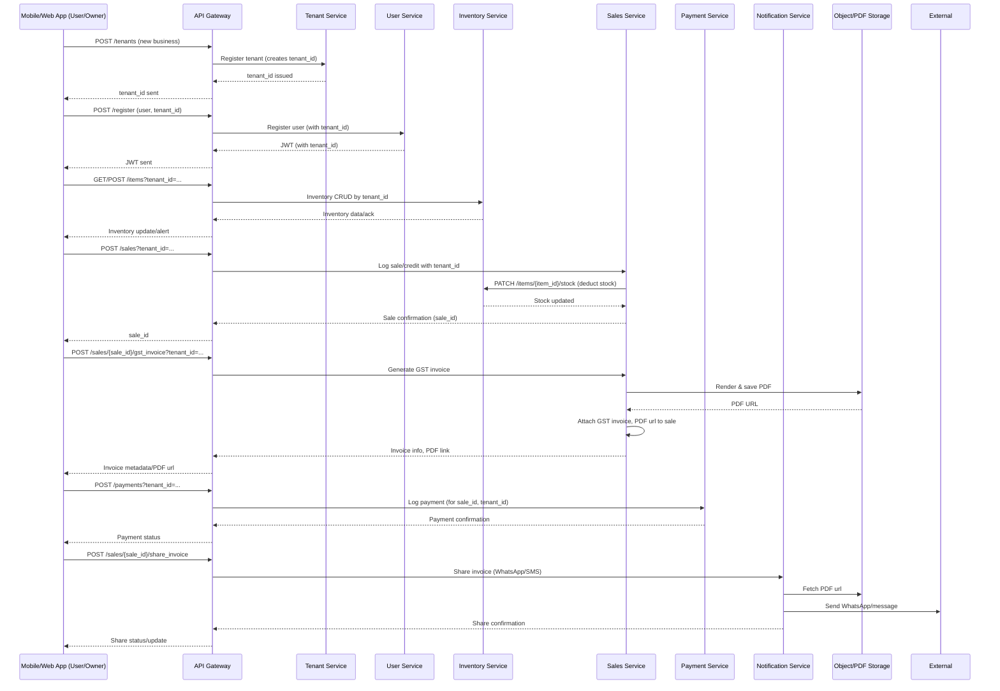

# Retail Management Platform – Data Flow (Mermaid Diagram)

Below is a comprehensive data flow for your multi-tenant retail platform, showing how requests and data traverse the system, how microservices interact, and where persistence and notifications occur. This diagram assumes a modern flow—covering onboarding, inventory, sales, GST invoicing, payments, and notifications.

## 1. End-to-End Data Flow Overview

## 2. Key Flow Summary

- **All API calls** must include `tenant_id` (from body, query, or JWT).
- **Each microservice** only sees and acts on its own tenant-scoped MongoDB database.
- **Integration points** occur for sale-to-inventory, sale-to-payment, and notification triggers.
- **PDF \& WhatsApp flows** are handled via sales service (PDF generation) and notification service (sending), with files stored in object storage or a static files server.
- **Audit and analytics** derive from these flows for summaries, compliance, and dashboarding.

This data flow ensures strict multi-tenancy, robust compliance, easy extensibility, and a clear developer/onboarding experience for your entire retail management SaaS.

