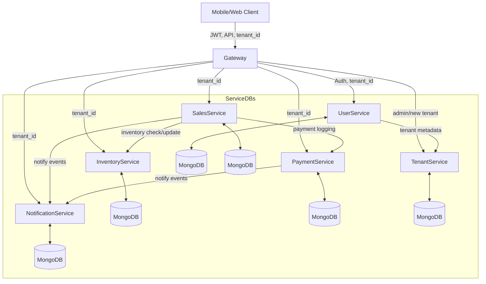
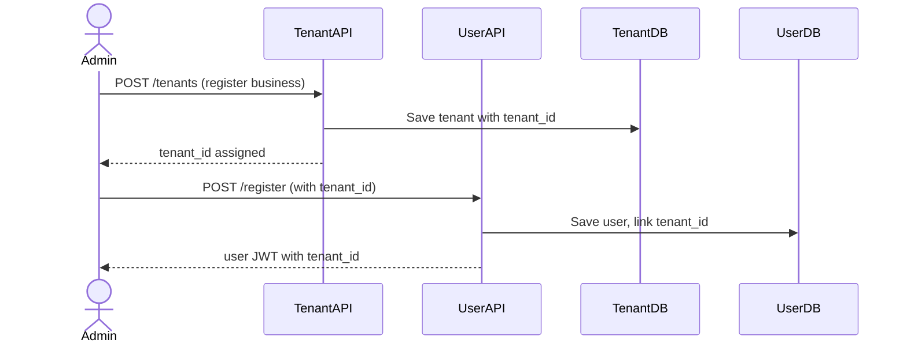
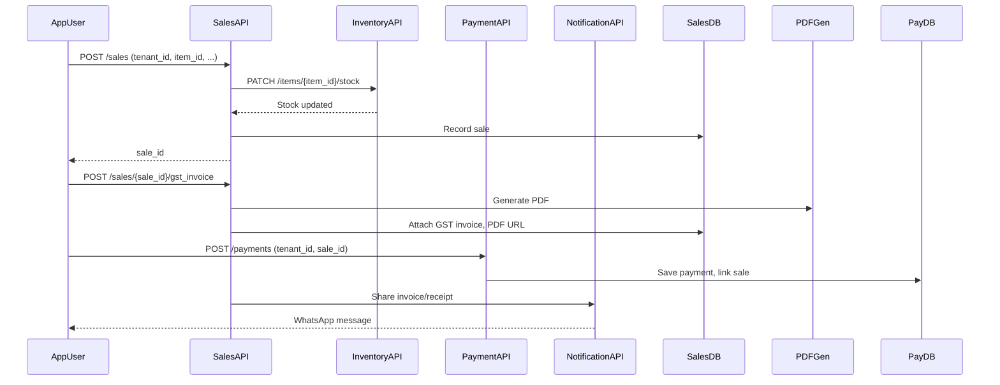
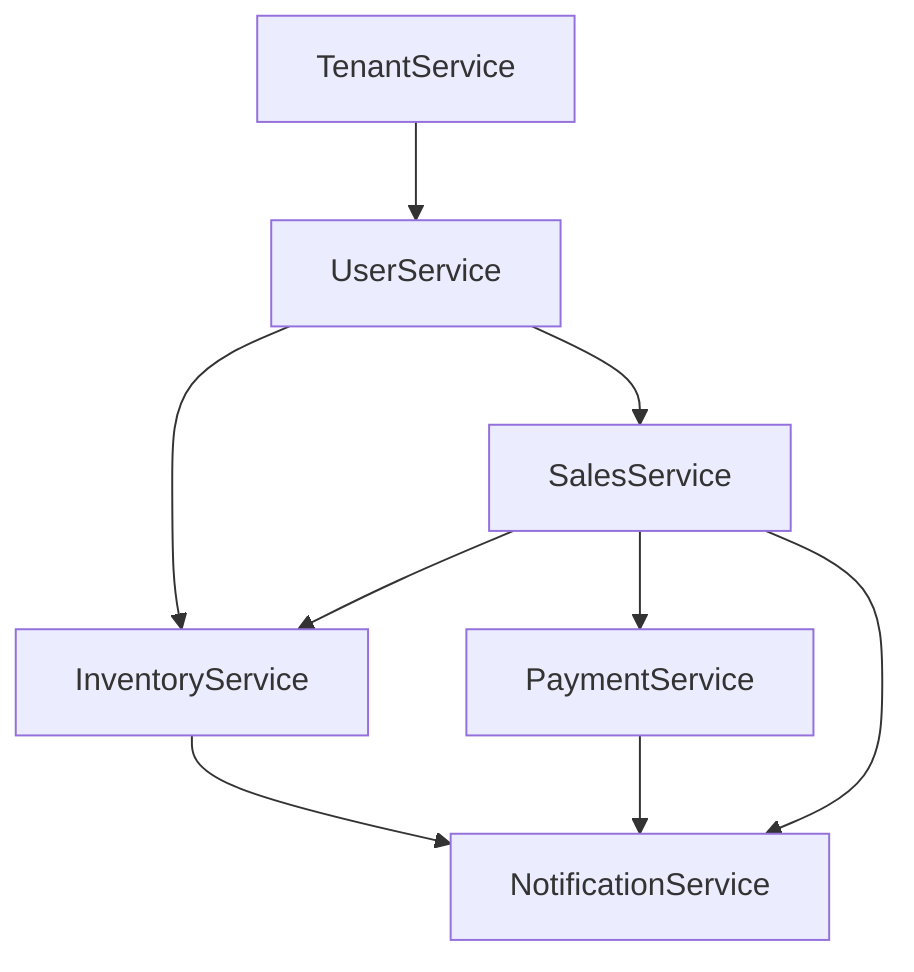

# Retail Management Platform – High Level Design (HLD)

## Purpose

This platform empowers multiple independent retail businesses (tenants) to manage users, inventory, sales (including GST/udhaar), payments, and notifications—each tenant’s data and workflow are fully isolated, supporting Indian compliance and digital adoption.

## 1. Architectural Overview

### **High-Level Microservice Topology**

**Key points:**

- All API traffic routed via API gateway or entrypoint, enforcing auth and tenant scope.
- Every microservice is deployed independently, each with its own MongoDB (“DB-per-service” pattern).
- Notification, payment, and inventory events are propagated via APIs or event hooks.

## 2. Service Roles \& Main Responsibilities

| Service | Responsibilities | Data Isolation |
| :-- | :-- | :-- |
| **Tenant** | Tenant registration, onboarding, business profiles | tenant_id |
| **User** | User sign-up, login, device profile, roles, per-tenant auth | tenant_id |
| **Inventory** | SKU manage, stock update, min-stock alerts | tenant_id, item_id |
| **Sales (Order)** | Daily sale/credit, GST invoice, summaries, udhaar tracking | tenant_id, sale_id |
| **Payment** | UPI/Cash logging, status update, analytics | tenant_id, payment_id |
| **Notification** | WhatsApp/SMS/email for reminders, invoices, low-stock, summaries | tenant_id, notif_id |

## 3. Deployment \& Technology Stack

- **API Framework:** FastAPI (Python)
- **Database:** MongoDB per microservice, each isolated
- **Auth:** JWT with `tenant_id` claim; validated on gateway/entry
- **Containerization:** Docker per service, ready for K8s
- **Observability:** Prometheus, Grafana, Jaeger per environment

## 4. Data Flow and Functional Scenarios

### **A. Business Onboarding Flow**

### **B. Sale, GST Invoice \& Payment**

## 5. Security and Isolation

- JWT required for all user and admin flows; tokens always scoped to a `tenant_id`.
- Every collection: **compound indexes** on (`tenant_id`, business-specific ID), strict multi-business isolation.
- Data cannot be read or written outside the authenticated tenant, at either the service or DB level.

## 6. Scalability and Extensibility

- Each service independently deployable/scalable based on load (e.g. inventory-heavy tenants scale only InventoryService).
- Notification, payment, and inventory integrations are pluggable: add SMS, email, UPI providers via adapters.
- Future support for advanced analytics, multi-location inventory (warehouse) per tenant, more payment methods.

## 7. Key API Endpoint Patterns

- `/api/service/operation?tenant_id=xxxx`
- POST/GET/PATCH/DELETE for CRUD; always with auth and `tenant_id` check
- Files (PDF invoices) are served via signed URLs or downloaded from `/static/invoices/` or cloud storage

## 8. Admin \& Developer Operations

- **Onboarding scripts** auto-generate test tenants, users, and inventory
- **OpenAPI/Swagger** available for every service (e.g. `/docs`)
- **Logs** include trace IDs, tenant_id for every request
- **Static/config templates** for GST invoices found in each service’s `/templates`

## 9. Module Dependency Diagram

**Interpretation:**

- Tenant comes first; all services depend on presence of tenant.
- User links Tenant, then all business/data flows utilize user context + tenant_id.
- Sales flow integrates inventory on order, payment on completion, and notifications for receipts or reminders.

## 10. Summary

- **Multi-tenant by design:** Each microservice, collection, and endpoint enforces data isolation with `tenant_id`.
- **Comprehensive B2B Coverage:** User, inventory, sales (with GST/udhaar), payment, notification—all modular, pluggable, and robust.
- **Production-Ready Security:** Auth and data boundaries built-in at all levels.
- **Intern/New Dev Ready:** Models, endpoints, and flows are documented, consistent, and extensible.

**This HLD empowers any team member to understand how each business’s data flows, how core features are delivered, and how new services (e.g. analytics, subscriptions) could be plugged in with full SaaS safety.**

