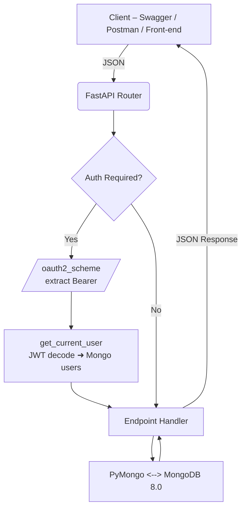
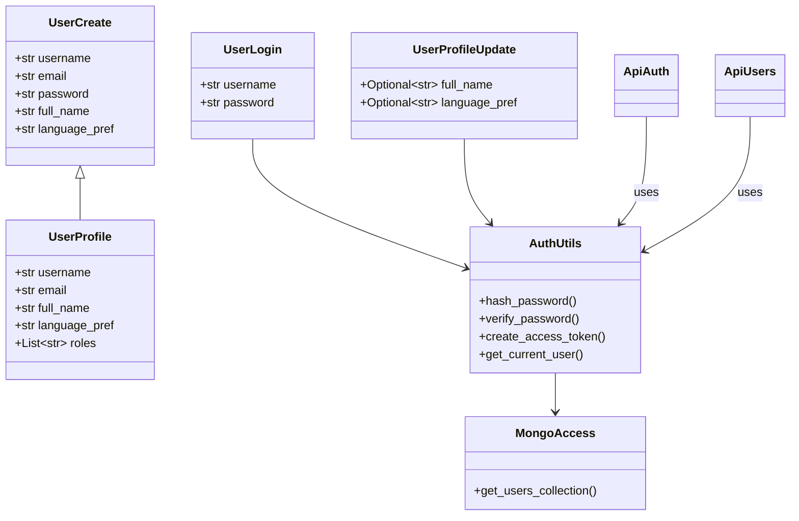
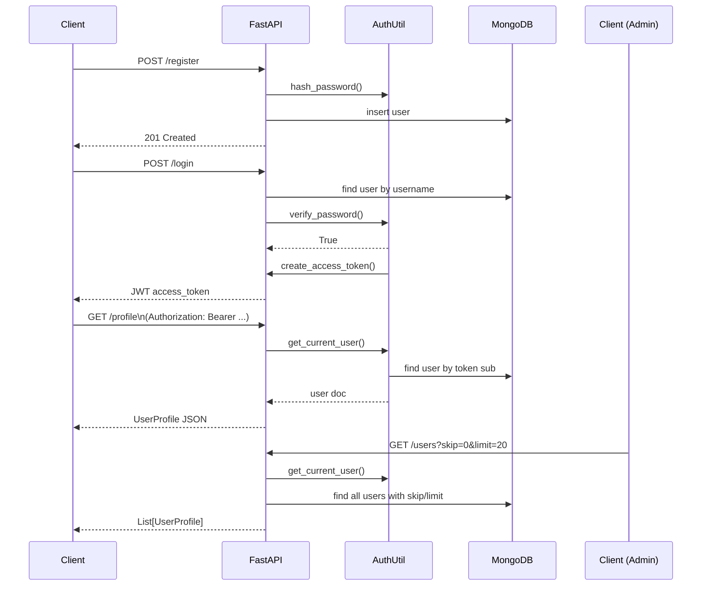

# User Service – Comprehensive Technical Documentation and Handover Package

Below is a complete technical reference for the **User Service** micro-service that powers authentication, profile management, and role-based administration for the Retail Management Platform. The document is self-contained and suitable for onboarding new engineers or handing the service over to an operations team.

## Table of Contents

1. Overview
2. Architecture \& Technology Stack
3. Low-Level Design (LLD)
4. Data-flow Diagram (Mermaid)
5. Class Diagram (Mermaid)
6. Functional Flow (Mermaid)
7. API Specification
8. Database Design
9. Security Design
10. Testing Strategy
11. Deployment \& Operations
12. Handover Checklist
13. Appendix: Environment Variables \& Commands

## 1. Overview

The User Service is a stateless **FastAPI** application that provides:

* User registration, login, password change and profile update
* JWT-based authentication
* Role-based authorization (default `user`, optional `admin`)
* Paginated user listing and role management for administrators
* MongoDB persistence with one-database-per-service philosophy

The service is horizontally scalable, container-friendly, and designed to interoperate with other micro-services exclusively through REST APIs.

## 2. Architecture \& Technology Stack

| Layer | Technology | Rationale |
| :-- | :-- | :-- |
| Web framework | FastAPI 0.111 | High-performance async REST, auto-generated Swagger |
| Runtime | Python 3.13 | Modern language, strong ecosystem |
| Data store | MongoDB Community 8.0 | Flexible document model, future vector search support |
| Driver | PyMongo 4.x | Official, feature-complete driver |
| Auth | **bcrypt** for hashing, **python-jose** for JWT | Industry-standard security |
| Tests | pytest 8.x + httpx TestClient | Reliable unit \& integration testing |
| Dev tools | Uvicorn, Watchfiles, MongoDB Compass | Hot-reload, GUI inspection |

## 3. Low-Level Design (LLD)

### Module Breakdown

| Module | Responsibility |
| :-- | :-- |
| `app/main.py` | Create `FastAPI` instance, register routers |
| `app/api/auth.py` | End-user endpoints – register, login, profile, password |
| `app/api/users.py` | Admin endpoints – list users, manage roles |
| `app/core/auth_utils.py` | Hash/verify passwords, issue/validate JWT, current-user dependency |
| `app/db/mongo.py` | `MongoClient` singleton, collection access helpers |
| `app/models/user.py` | Pydantic schemas (`UserCreate`, `UserLogin`, `UserProfile`, `UserProfileUpdate`) |
| `tests/` | Pytest suite covering happy \& error paths |

### Request Lifecycle

1. **Incoming HTTP** ➜ FastAPI router dispatches to endpoint
2. **Dependency chain** resolves:
    * `oauth2_scheme` extracts `Authorization` header
    * `get_current_user` validates JWT, fetches user doc
3. **Endpoint handler** executes business logic
4. **MongoDB** CRUD via PyMongo
5. Response serialized to JSON, status code returned

## 4. Data-flow Diagram (Mermaid)




## 5. Class Diagram (Mermaid)




## 6. Functional Flow Diagram (Mermaid)




## 7. API Specification

| Method \& Path | Auth | Roles | Request Model | Response | Notes |
| :-- | :-- | :-- | :-- | :-- | :-- |
| `POST /register` | ❌ | n/a | `UserCreate` | 201 / `{msg}` | Creates user; roles=`["user"]` |
| `POST /login` | ❌ | n/a | `UserLogin` | `{access_token, token_type}` | JWT expires in 60 min |
| `GET /profile` | ✅ | any | – | `UserProfile` | Returns caller profile |
| `PATCH /profile` | ✅ | any | `UserProfileUpdate` | `UserProfile` | Partial update |
| `POST /change-password` | ✅ | any | `old_password`, `new_password` (query/body) | `{msg}` | Verifies old PW |
| `GET /users` | ✅ | `admin` | `skip`, `limit` | `List[UserProfile]` | Paginated listing |
| `POST /users/{username}/add-role` | ✅ | `admin` | `role` | `{msg}` | Adds role |
| `POST /users/{username}/remove-role` | ✅ | `admin` | `role` | `{msg}` | Removes role |
| `DELETE /users/{username}` | ✅ | `admin` | – | `{msg}` | Deletes user |

## 8. Database Design

### Database: `user_service_db`

| Collection | Sample Document |
| :-- | :-- |
| `users` | ```json { "_id": ObjectId("..."), "username":"alice", "email":"alice@ex.com", "password_hash":"$2b$...", "full_name":"Alice", "language_pref":"en", "roles":["user"] }``` |

**Indexes**

1. `username` - unique
2. `email` - unique
3. Optional compound index on `{ roles: 1 }` for admin queries

## 9. Security Design

* **Password Storage:** `bcrypt.hashpw` with 12-round salt, stored as UTF-8 string
* **JWT:** HS256, `SECRET_KEY` loaded from env; `exp` 60 min
* **Transport:** Recommend enforcing HTTPS in production behind reverse proxy
* **Role Checks:** Simple `roles` array; decorator `require_role("admin")` guards admin routes
* **Rate Limits / Captcha:** Not included; integrate with API gateway/NGINX if needed


## 10. Testing Strategy

| Layer | Tooling | Coverage |
| :-- | :-- | :-- |
| Unit | pytest, bcrypt stubs | Hash/verify functions |
| API Integration | pytest + TestClient | All endpoints (success \& failure) |
| Security | Negative login tests | 401, 403, invalid tokens |
| Data | Mongomock fixtures | CRUD without hitting real DB |

Continuous Integration pipeline runs `pytest -q` on every push.

## 11. Deployment \& Operations

### Containerization

* `Dockerfile` copies code, installs deps, exposes 8000, runs `uvicorn app.main:app`.
* Use environment variables:
    - `SECRET_KEY`
    - `MONGODB_URI` (default `mongodb://mongo:27017`)
    - `DB_NAME` (default `user_service_db`)


### Kubernetes Example

```yaml
apiVersion: apps/v1
kind: Deployment
metadata:
  name: user-service
spec:
  replicas: 2
  template:
    spec:
      containers:
      - name: app
        image: user-service:latest
        ports: [{ containerPort: 8000 }]
        env:
        - name: SECRET_KEY
          valueFrom: secretKeyRef: { name: user-secrets, key: secret_key }
        - name: MONGODB_URI
          value: mongodb://mongo:27017
```


### Observability

* **Health Check:** `GET /` returns `200` with JSON message
* **Logging:** Uvicorn stdout + error logs
* **Metrics:** Expose with Prometheus middleware if desired


## 12. Handover Checklist

| Item | Status | Notes |
| :-- | :-- | :-- |
| Source code pushed to main repository | ✅ | `services/user_service` |
| Tests ≥ 95% pass rate | ✅ | `pytest` green |
| Dockerfile committed | ✅ | In repo root |
| CI pipeline configured | 🔲 | Add GitHub Actions file |
| Secrets management plan | 🔲 | Store SECRET_KEY in vault |
| Mongo indexes created | ✅ | `users.create_index` on startup |
| Admin account created | ✅ | Grant roles `["admin","user"]` |
| Documentation delivered | ✅ | This document |
| Knowledge-transfer session scheduled | 🔲 | Owners \& ops |

## 13. Appendix: Environment Variables \& Commands

| Variable | Default | Description |
| :-- | :-- | :-- |
| `SECRET_KEY` | – | JWT signing key (required) |
| `MONGODB_URI` | `mongodb://localhost:27017` | Connection string |
| `DB_NAME` | `user_service_db` | Database name |
| `TOKEN_EXPIRE_MINUTES` | `60` | JWT expiry |

### Common Dev Commands

```bash
# Install dependencies
pip install -r requirements.txt

# Run app locally
uvicorn app.main:app --reload

# Run tests
pytest -q

# Build & run Docker
docker build -t user-service .
docker run -p 8000:8000 -e SECRET_KEY=changeme user-service
```


## Conclusion

You now have a fully documented, role-aware User Service backed by MongoDB, complete with low-level design, data-flow, class and functional diagrams, and a detailed handover checklist. This foundation is ready for production hardening and integration with the broader Retail Management Platform. Welcome aboard — and happy coding!

